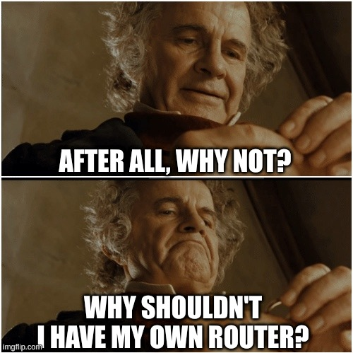

Apert is an open-source router project based on NixOS.

The name apert is inspired by the aperture of a camera that opens and closes to
control the amount of light into the camera. Similarly, apert opens and closes
to control the amount of data that enters the home network. Apert is also
inspired by the book "Anathem" by Neil Stephenson, in which a giant door opens
periodically to control the spread of information.

# Motivation

# Credits

* Camera aperture logo: Diaphgram Apertures SVG Vector from svgrepo.com
* Bilbo "Why shouldn't I" meme: imgflip.com
* Apert logo font: Alcubierre from dafontfree.io
